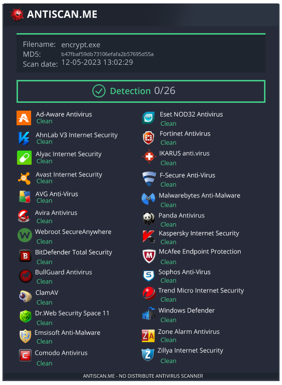

[](./LICENSE)
    

> PS: This project is purely academic, use at your own risk. I will not condone, in any way, the use of this software illegally or to attack targets without their authorization.
## 💰 SafeCrypt 💣
## 💰 What is a Ransomware 💴
Ransomware is a type of malicious software, also known as malware, that is designed to block access to a victim's computer system and encrypt their files until a ransom is paid to the attacker.

Ransomware can be distributed through a variety of methods, including phishing emails, infected websites, and social engineering tactics. Once installed on a victim's system, the ransomware can spread to other computers and networks, further increasing the damage.

## 💰 The Project 📽️

This project was developed as part of the Red Team in Clalit Health Care. It will encrypt all of your files in the background using AES-256-CTR, and asymetric encryption, Using RSA public key and the padding scheme from PKCS #1 v1.5 to secure the key exchange with the server.

The project is composed by three parts, the Server, Encrypter and Decrypter.

The Server stores the victim's Hostname & Local IPv4 addresses along with the encryption key used by the malware.

## 💰 Features 👾
- Encrypts files using AES-256-CTR(Counter Mode) with random IV for each file.
- Multithreading (Calculates the best approach for each thread)
- RSA and the padding scheme from PKCS #1 v1.5 to secure the client/server communication
- Includes an Encrypter
- Uses AES CTR Cypher with stream encryption to avoid loading an entire file into memory.

## 💰 Building the project 🗑️
> DON'T RUN encrypter.exe IN YOUR PERSONAL MACHINE, EXECUTE ONLY IN A TEST ENVIRONMENT! It will encrypt all your disks!
First, download the project outside your $GOPATH:

```powershell
git clone https://github.com/maorsabag/safecrypt
cd safecrypt
```

Getting the dependencies needed for Golang
```powershell
make requirements
```

Compiling Everything!
```powershell
make
```

Compiling the Keygen
```powershell
make keys
.\bin\keygen.exe
```
This will generate a ```public_key.pem``` and ```private_key.pem``` in the current folder.
The ```public_key.pem``` will be used by the Encrypter and the ```private_key.pem``` will be used by the Server for decrypt the encryption key together with the target information.
Move both files to the ```assets``` folder.

Compiling the Decrypter
The console one needs to have the encryption key hard-coded. After getting the key from the server, change the variable: hexKey at line 20 and compile it.
```powershell
make decrypt
```

Compiling the Encrypter
```powershell
make encrypt
```

Compiling the Server
By default the server is compiled to linux to run the server in the cloud
```powershell
make backend
```

Setting the .env file
Create a .env file in the same directory as the server binary with the following content:
```
TELEGRAM_API
TELEGRAM_GROUP
```
You can get the TELEGRAM_API from https://my.telegram.org/apps and the TELEGRAM_GROUP is the chat ID of the group you want to send the messages to. You can get it by adding the bot to the group and sending a message, then using the getUpdates method from the Telegram Bot API.


## 💰 The end ⚖️


[](./LICENSE)
